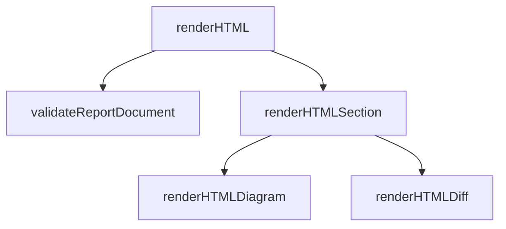

# Mate Show Me

> Inspired by [humanlayer's show-me skill](https://github.com/humanlayer/skills/tree/main/plugins/show-me/skills/show-me) and adapted here as a Mate process-driven skill.

Explain the current topic visually in a browser-rendered Mate report. Skip the preamble, keep prose brief, and pick the smallest report view that makes the key point clear.

## Mate Workflow

- Explanation only. Never write or edit source code, tests, documentation, OpenSpec artifacts, context files, or ADRs. The only file this skill produces is the report document handed to `mate report --input`, which the CLI writes into the operating system temporary directory.
- Draw from the repositories, not from memory. Every diagram and every diff line comes from the inspected repository state, never from recollection of the conversation. Use the available code-graph tools before broad source scans.
- Code lives in the Working Repository; the Companion Repository holds only artifacts. Run `git diff` in the Working Repository.
- Never put an absolute local path, home directory, username, machine name, temporary report path, Companion Repository path, or raw path-valued environment variable in the report. Use repository-relative paths or neutral labels such as `Working Repository` and `Companion Repository`.
- Never commit, push, or create a pull request.

## Browser Report Required

Always assemble and open a Mate report, even when a small inline sketch would be sufficient. Do not answer with an inline-only visual or paste the complete diagram or diff into the conversation. The final response should briefly state what the browser report shows without repeating its temporary file path.

## Report Contents

- Show logic or an algorithm as a `diagram` section. Use a `mermaid` payload when branches, stages, or relationships benefit from a rendered visual; reserve `text` for compact pseudocode:

```text
on(save)
  if content is unchanged
    return cached result
  write new content
  return fresh result
```

- Show runtime control flow as a `diagram` section with a `mermaid` payload. Use `flowchart TD` for a call tree or control flow and `sequenceDiagram` when ordering between components matters:



- Show UI structure as a `diagram` section with a `mermaid` payload when showing relationships between components or modules. Use a `text` payload only when exact component syntax is the point, including the state boundaries that matter:

```tsx
<WorkflowView> (studio/views/workflow/index.tsx)
  workflowPlan(availableSkills)
  <StepList>
    <StepRow optional>
```

- Show file responsibility or a broad refactor as a `diagram` section with a `text` payload containing a shallow file tree:

```text
src/
|-- commands/      # parses user actions
|-- report/        # owns the report contract and renderer
`-- templates/     # ships assets and skills
```

- Show what changes as a `diff` section when the surrounding shape already exists. Match the diff shape to the topic - component tree, file layout, call tree, or control flow:

```diff
 on(save)
-  write content
+  if content is unchanged
+    return cached result
+  write new content
```

- Show a whole block in the report when most of it is new, when omitted context would hide ownership or order, or when the user needs a copyable target shape.

## Browser Delivery

The report is mandatory. Prefer `mate report --input <temporary-json-file>` without `--json` so the CLI reads the complete document reliably, writes self-contained HTML, and opens it in the default browser. The CLI also supports `mate report --input -` when JSON is piped to stdin; if stdin delivery reports empty or truncated JSON, switch to a temporary JSON file rather than retrying the same transport. If validation fails, fix the report document and retry; do not fall back to an inline explanation or JSON-only delivery.

Never hand-write an HTML file, never start a server, and never open a browser by any other means. `mate report` is the only browser surface.

## Assembling The Report

Build a JSON document that conforms to the `mate-create-report` contract, then hand it over:

1. Serialize the complete document to an OS temporary JSON file outside both repositories. Do not place the report input in the Working Repository or Companion Repository.
2. Run `mate report --input <temporary-json-file>`.

A report assembled by this skill carries:

- `metadata` naming the subject and a neutral repository label, never a local path
- one `diagram` section for the structure or flow at issue, even when the visual is small
- use a `mermaid` payload for runtime control flow, call trees, data flow, or component relationships; use `text` only when a sketch or pseudocode is clearer
- one `diff` section carrying the unified diff, when there is something to diff
- a short `text` section next to each visual, saying what the reader should notice

A `diagram` section carries exactly one payload: `mermaid` for diagram source the report draws as a picture, or `text` for a monospace ASCII sketch or pseudocode block. A `diff` section carries a unified `patch` string.

```json
{
  "id": "structure",
  "title": "Report rendering",
  "type": "diagram",
  "mermaid": "classDiagram\n  Renderer --> Highlight : uses"
}
```

```json
{
  "id": "changes",
  "title": "What changed",
  "type": "diff",
  "patch": "diff --git a/src/acme.ts b/src/acme.ts\n..."
}
```

If the document fails contract validation, report the diagnostic and correct the document. Do not fall back to hand-written HTML.

## Mermaid Authoring Rules

- Use Mermaid whenever the user asks for a diagram or the subject has meaningful control flow, sequencing, lifecycle, or relationships. A `text` payload is a deliberate fallback, not the default for runtime flows.
- Pick the diagram type that matches the question: `classDiagram` for structure, `sequenceDiagram` for interaction between components, `stateDiagram-v2` for lifecycles, `flowchart TD` for control flow and call trees.
- Keep labels short enough to read at report width. A label that needs a sentence belongs in the neighbouring `text` section.
- Do not use ELK-only layouts or math labels. The report inlines the self-contained mermaid bundle, which may not carry those chunks.
- Pair each Mermaid visual with a short neighbouring `text` section that calls out the ownership boundary or invariant the reader should notice.
- Prefer the `text` payload for pseudocode, shallow file trees, or cases where a picture would genuinely obscure the point.

## Reviewing An Applied Change

- Read the change scope before drawing it, then diagram the structure or flow the change establishes - not the structure it replaced.
- Take the diff from `git diff` in the Working Repository. Keep only repository-relative paths in the patch, default to the working tree, and ask the user when their intent is a committed range instead.
- When the inspected scope has no changes, say so and omit the `diff` section. Never invent a patch.
